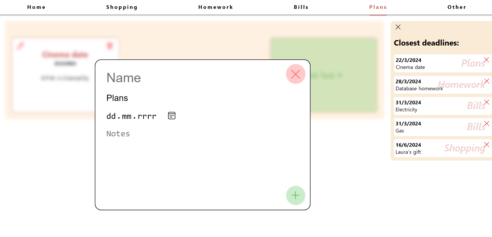
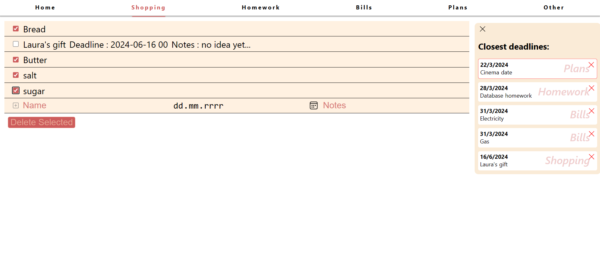
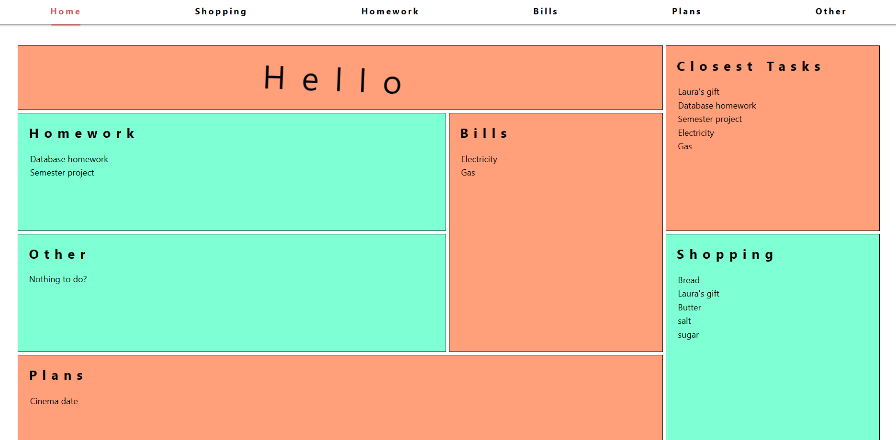

# HomeManagment
React + Django App used for organizing home errands. The app uses:
- React for frontend
- Django REST for backend

## Functionality
Lets you perform basic CRUD operations on tasks organized into 5 different categories and display them accordingly. Additional toggleable sidemenu lets you know which tasks are due soon.







## How to run

Once you have downloaded the repo run:
```
pip install -r requirements.txt
```
then `cd` into `home_managment` and run
```
python manage.py migrate
python manage.py runserver
```
Web app will be available at 127.0.0.1:8000


## Issues 
The app is fully functional however it is not really optimized. Later into development I realized I could have had the frontend hit the backend fewer times with it`s requests. As of now the DB is hit on every tab change and also 6 seperate times on first load
